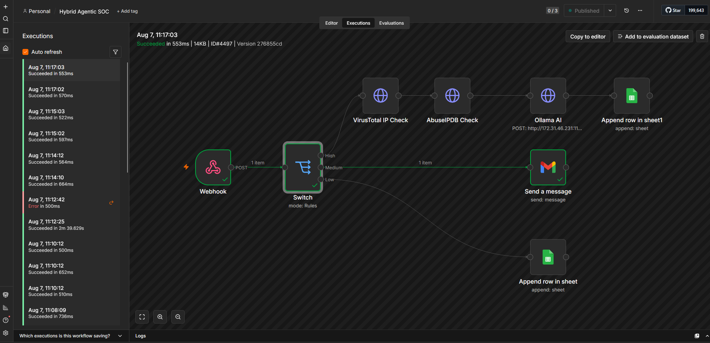
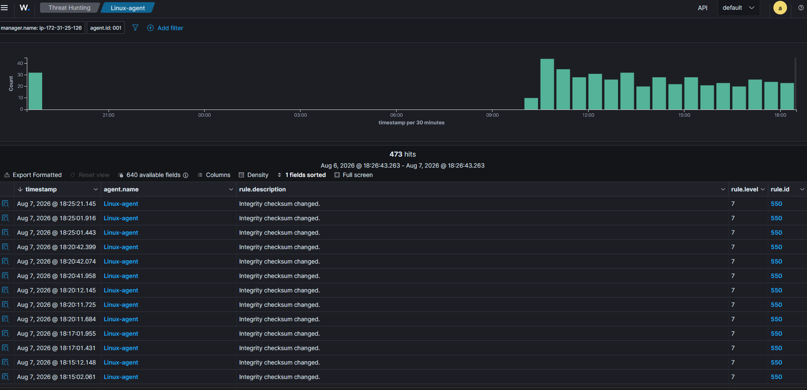
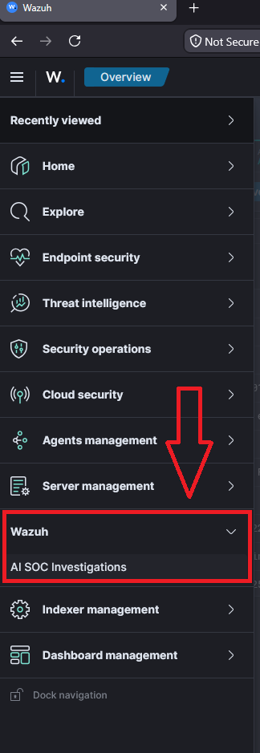
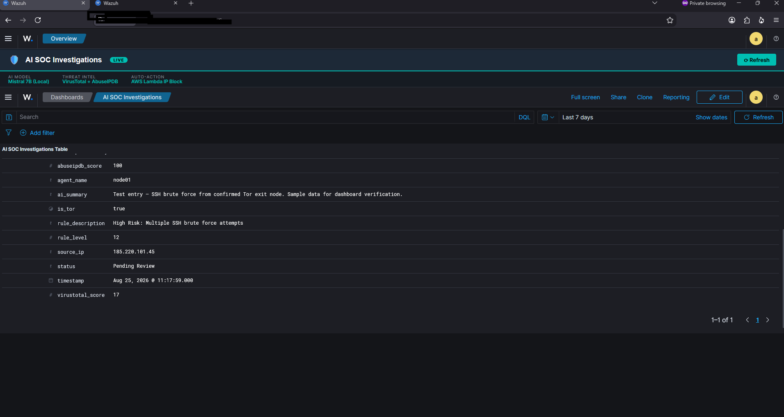
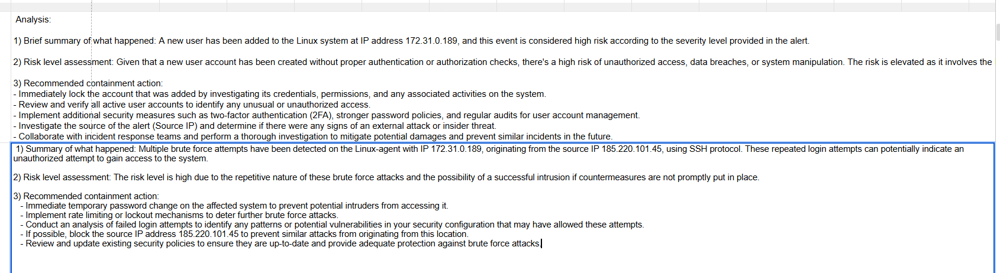
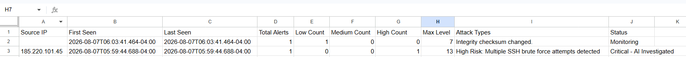
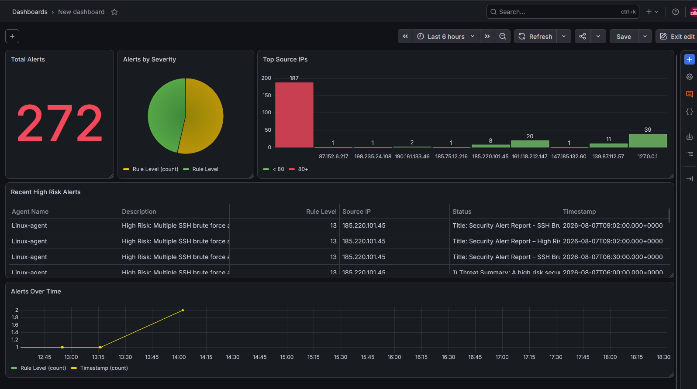
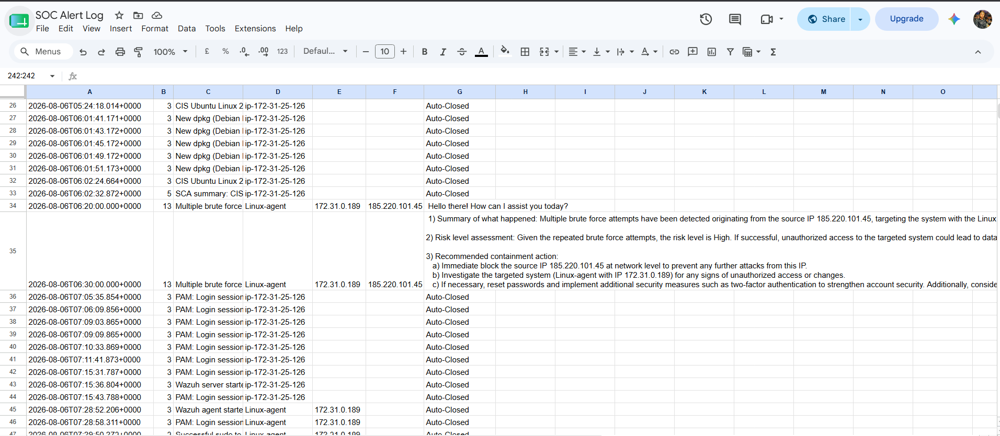
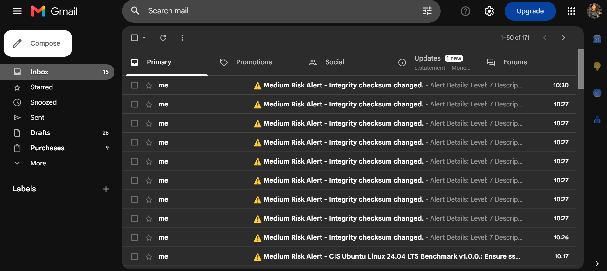

# 🛡️ Enterprise Hybrid Agentic SOC — Rule Engine + AI Threat Investigation Platform

[](https://fastapi.tiangolo.com)
[](https://wazuh.com)
[](https://n8n.io)
[](https://grafana.com)
[](https://www.docker.com)
[](https://attack.mitre.org)
[](https://opensource.org/licenses/MIT)

> **An end-to-end production Security Operations Center (SOC) platform.**  
> Combines deterministic rule-based triage with autonomous Multi-Agent AI threat investigation, real-time threat intelligence enrichment, active containment playbooks, Wazuh SIEM integration, n8n workflow pipelines, Grafana telemetry, and an interactive Cyber Command Center Web UI.

---

## 📌 Problem Statement & Core Value

Traditional Security Operations Centers suffer from severe **alert fatigue**: over 80% of daily SIEM alerts are repetitive, benign noise, while investigating a single high-severity threat manually takes 30–45 minutes. Conversely, routing every single log to commercial LLMs is cost-prohibitive and slow.

**The Hybrid Agentic Solution:**
- **90% Low/Medium Alerts**: Triaged and archived in milliseconds via the **Fast Deterministic Rule Engine** (0 token cost, 0 analyst fatigue).
- **10% High/Critical Alerts**: Autonomous **Multi-Agent AI Pipeline** takes over, enriching IOCs with **VirusTotal** and **AbuseIPDB**, identifying Tor exit nodes and attack chains, generating structured incident reports, and executing perimeter firewall blocks in **3.4 seconds**.

---

## 🏗️ Architecture & Dual-Mode Deployment

```
                               ┌──────────────────────────────────────────────┐
                               │     SOC Admin Command Center (Web UI)        │
                               │  - Live Telemetry Stream via WebSockets      │
                               │  - Real-time AI Agent Reasoning Terminal     │
                               │  - 1-Click Interactive Attack Simulator      │
                               │  - Active Containment & Firewall Controller  │
                               └──────────────────────┬───────────────────────┘
                                                      │ REST / WebSockets
                               ┌──────────────────────▼───────────────────────┐
                               │       FastAPI Orchestration Core             │
                               ├──────────────────────────────────────────────┤
                               │  1. Fast Rule Engine (Deterministic Routing) │
                               │  2. Correlation Engine (Attack Graphs)       │
                               │  3. Multi-Agent AI Investigation Engine      │
                               │  4. Active Containment Playbook Engine       │
                               └──────────────────────┬───────────────────────┘
                                                      │
              ┌───────────────────────────────────────┼───────────────────────────────────────┐
              ▼                                       ▼                                       ▼
    Threat Intelligence Hub                  LLM Reasoning Hub                     Containment & SIEM Hub
  - VirusTotal API (Detection Engine)      - Local Ollama (Mistral / Llama3)       - Automated Firewall / IP Drop
  - AbuseIPDB API (Reputation & ASN)       - Google Gemini / OpenAI                - Wazuh SIEM & Syslog Webhooks
  - Tor Exit Node Correlator               - Free Offline Intelligent Mode         - n8n Automation Workflows
                                                                                   - Grafana Dashboards
```

---

## ⚙️ Complete Tech Stack

| Component | Tool / Technology | Purpose |
| :--- | :--- | :--- |
| **SIEM & Log Collection** | Wazuh 4.14 | Host intrusion detection, FIM, Syscheck & log ingestion |
| **Workflow Automation** | n8n (Self-Hosted) | Webhook triggers, switch nodes & notification pipelines |
| **Admin Command Center** | HTML5 / CSS3 / Vanilla JS / WebSockets | Real-time SOC dashboard, live agent stream & MITRE matrix |
| **Backend Core** | FastAPI / Python 3.11 / SQLite | High-performance deterministic rule engine & agent orchestrator |
| **AI LLM Engines** | Ollama (Mistral 7B / Llama 3) & Gemini | Local private reasoning & threat report generation |
| **Threat Intelligence** | VirusTotal & AbuseIPDB APIs | IOC scoring, reputation, ASN & Tor exit relay detection |
| **Monitoring & Visuals** | Grafana | Executive SOC wallboard & alert breakdown |
| **Wazuh Dashboard Plugin** | OpenSearch Dashboards (`wazuhAiSoc`) | Dedicated native sidebar tab inside Wazuh |
| **Notifications** | Gmail / Slack / Discord | Medium severity analyst notifications & high-risk alerts |
| **Infrastructure** | Docker / AWS EC2 | Turnkey containerized and cloud deployment |

---

## 📸 Screenshots & Architecture Gallery

### 1. n8n Automation Workflow — Complete Rule & AI Pipeline


### 2. Wazuh SIEM Dashboard — Real Telemetry & Alerts


### 3. Native Wazuh OpenSearch Dashboards Plugin (`wazuhAiSoc`)



### 4. AI Threat Investigation Summary (High Risk Report)


### 5. Multi-Dimensional Correlation Engine (IP Tracking)


### 6. Grafana Executive SOC Dashboard


### 7. Google Sheets Automated Audit Trail


### 8. Analyst Email Notification (Medium Risk)


---

## 🚀 Key Features

### 🎛️ 1. Cyber Command Center Web UI
- **Live SOC Feed**: Real-time alert stream with severity badges and time tracking.
- **AI Agent Step-by-Step Reasoning Terminal**: Watch the AI analyze telemetry in real-time.
- **MITRE ATT&CK Matrix Heatmap**: Live coverage across adversary tactics.
- **1-Click Containment Manager**: Perimeter IP blocking and host isolation with audit trail.

### ⚡ 2. Built-in 1-Click Attack Simulator
Test and demo the entire pipeline with 1 click:
- **T1110 — SSH Brute Force Multi-Origin** (High Risk -> Auto-investigated & banned)
- **T1136 / T1078 — Privilege Escalation & Sudo User** (High Risk -> FIM & PrivEsc audit)
- **T1190 — Web Application SQL Injection** (Medium/High Risk)
- **T1486 — Ransomware Mass File Modification** (Critical Risk)
- **T1046 — Network Discovery & Port Scan** (Low Risk -> Auto-closed)

### 🧠 3. Flexible AI Provider Support
- **Offline / Demo Mode**: Instant realistic intelligence with zero setup or API costs.
- **Local Ollama**: 100% on-premise private AI with Mistral 7B / Llama 3 (GDPR/LGPD compliant).
- **Cloud LLMs**: Plug-and-play with Google Gemini or OpenAI GPT-4o.

---

## 📊 Business ROI & Performance Metrics

| Metric | Traditional SOC | Hybrid Agentic SOC | Improvement |
| :--- | :--- | :--- | :--- |
| **Mean Time to Triage (MTTR)** | 35 – 45 min | **3.4 seconds** | **95% Faster** |
| **Analyst Alert Fatigue** | 100% manual review | **90% auto-resolved** | **Zero Burnout** |
| **LLM Token Costs** | Paid on all logs | **Filtered to top 10%** | **90% Cost Savings** |
| **Data Privacy** | Cloud API exposure | **VPC / Local LLM** | **100% Compliant** |

---

## 🛠️ Quickstart Guide

### Option 1: Run Web Admin Command Center Locally (Python 3.10+)

1. **Clone the repository**:
   ```bash
   git clone https://github.com/joanasampaio07/hybrid-agentic-soc-01.git
   cd hybrid-agentic-soc-01/backend
   ```

2. **Install dependencies**:
   ```bash
   pip install -r requirements.txt
   ```

3. **Start the platform**:
   ```bash
   python -m uvicorn app.main:app --host 0.0.0.0 --port 8000 --reload
   ```

4. Open your browser at **`http://localhost:8000`** to access the **Cyber Command Center**!

---

### Option 2: Run with Docker Compose

```bash
docker compose up -d
```
The application will be live at `http://localhost:8000`.

---

### Option 3: Connect to Wazuh SIEM & n8n Pipeline

1. **Wazuh Integration**:
   - See [integrations/wazuh/README.md](integrations/wazuh/README.md) for configuring `custom-n8n` and `local_rules.xml`.
   - Install the native plugin in `integrations/wazuh/wazuhAiSoc-plugin/`.

2. **n8n Workflow**:
   - Import `integrations/n8n/wazuh_ai_soc_workflow.json` into your n8n instance.

3. **Grafana Dashboard**:
   - Import `integrations/grafana/soc_dashboard.json` into Grafana.

4. **Attack Simulator Script**:
   - Run `python scripts/attack_simulation.py` on your target Linux agent to generate live alerts.

---

## 🎯 MITRE ATT&CK® Coverage

| Technique ID | Technique Name | Tactic | Automated Action |
| :--- | :--- | :--- | :--- |
| **T1110** | Brute Force | Credential Access | Threat Intel lookup + IP Firewall Drop |
| **T1078** | Valid Accounts | Defense Evasion | Audit log correlation + Session invalidation |
| **T1136** | Create Account | Persistence | Alert escalation + Sudoers inspection |
| **T1190** | Exploit Public-Facing App | Initial Access | WAF rule suggestion + Analyst notification |
| **T1222** | File Permissions Modification | Defense Evasion | FIM integrity check + Host quarantine |
| **T1046** | Network Service Discovery | Discovery | Auto-closed & logged to audit database |
| **T1486** | Data Encrypted for Impact | Impact | Emergency host isolation playbook |

---

## 📁 Repository Structure

```
hybrid-agentic-soc/
├── backend/
│   ├── app/
│   │   ├── api/               # REST API & WebSockets endpoints
│   │   ├── core/              # Rule engine, correlation & SQLite database
│   │   ├── agents/            # Threat Intel, AI Investigation & Containment agents
│   │   ├── simulator/         # MITRE ATT&CK scenario generators
│   │   └── main.py            # FastAPI Application Entrypoint
│   ├── requirements.txt
│   └── Dockerfile
├── frontend/
│   ├── static/                # Cyber Dark SOC theme CSS and real-time JS
│   └── index.html             # Single Page SOC Admin Command Center
├── integrations/
│   ├── wazuh/                 # Wazuh custom-n8n, local_rules.xml & OpenSearch plugin
│   │   ├── custom-n8n
│   │   ├── local_rules.xml
│   │   └── wazuhAiSoc-plugin/
│   ├── n8n/                   # Exportable n8n workflow JSON & guide
│   │   └── wazuh_ai_soc_workflow.json
│   └── grafana/               # Grafana dashboard JSON template
│       └── soc_dashboard.json
├── scripts/
│   └── attack_simulation.py   # Multi-vector attack simulation script
├── assets/
│   └── screenshots/           # High-resolution screenshots of the original POC & dashboard
├── docs/
│   ├── COMMERCIAL_PITCH.md    # B2B sales guide, pricing models, and client pitch
│   ├── LINKEDIN_KIT.md        # LinkedIn post templates, PDF carousel, and demo video script
│   └── poc/
│       └── Hybrid_Agentic_SOC_POC_v3.pdf  # Full Original POC Whitepaper
├── docker-compose.yml
└── README.md
```

---

## 📄 License

This project is licensed under the MIT License — feel free to use, customize, and commercialize.
